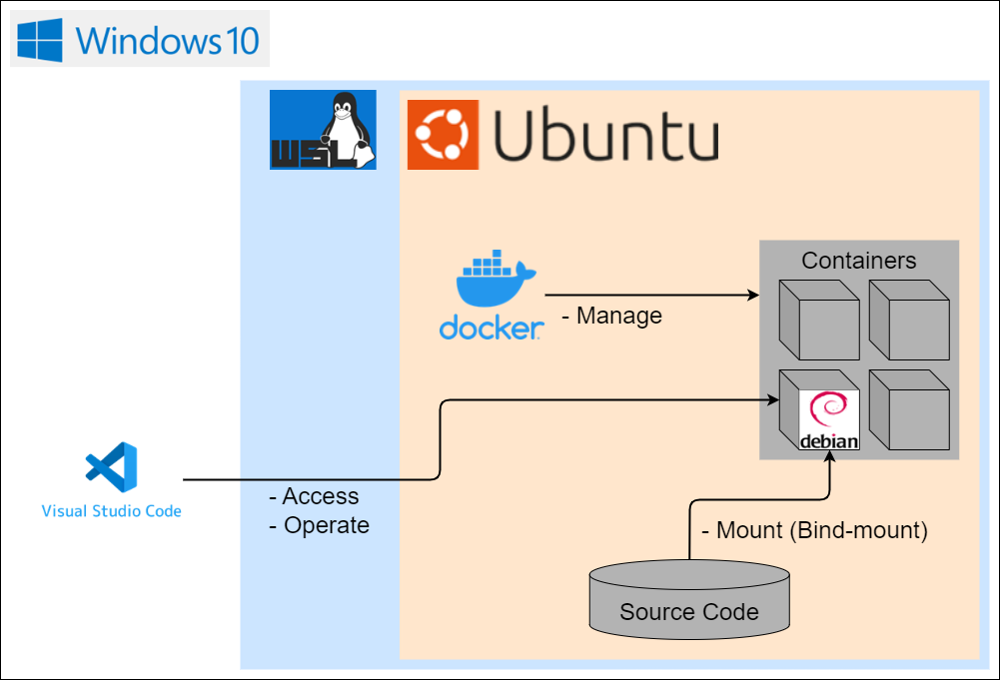

# dev-env-for-windows <!-- omit in toc -->

- [1. 概要](#1-概要)
- [2. 構成図](#2-構成図)
  - [2.1. \[補足事項\] なぜWindowsから敢えてUbuntuを経由してコンテナを起動する構成にしているのか](#21-補足事項-なぜwindowsから敢えてubuntuを経由してコンテナを起動する構成にしているのか)
    - [2.1.1. 参考サイト](#211-参考サイト)
- [3. セットアップ方法](#3-セットアップ方法)
  - [3.1. VSCode(Visual Studio Code)のインストール](#31-vscodevisual-studio-codeのインストール)
    - [3.1.1. 参考サイト](#311-参考サイト)
  - [3.2. WSL2(Windows Subsystem for Linux 2)の有効化](#32-wsl2windows-subsystem-for-linux-2の有効化)
    - [3.2.1. 参考サイト](#321-参考サイト)
  - [3.3. Ubuntu(Ubuntu 22.04 on WSL2)のインストール](#33-ubuntuubuntu-2204-on-wsl2のインストール)
    - [3.3.1. Ubuntuのインストール](#331-ubuntuのインストール)
      - [3.3.1.1. 参考サイト](#3311-参考サイト)
    - [3.3.2. DNSサーバーの設定](#332-dnsサーバーの設定)
      - [3.3.2.1. 参考サイト](#3321-参考サイト)
    - [3.3.3. Gitの設定](#333-gitの設定)
      - [3.3.3.1. 参考サイト](#3331-参考サイト)
    - [3.3.4. Gitリポジトリのクローン](#334-gitリポジトリのクローン)
    - [3.3.5. \[任意\] WSL2のメモリサイズの設定](#335-任意-wsl2のメモリサイズの設定)
      - [3.3.5.1. 参考サイト](#3351-参考サイト)
    - [3.3.6. \[任意\] 日本語化](#336-任意-日本語化)
      - [3.3.6.1. 参考サイト](#3361-参考サイト)
    - [3.3.7. \[任意\] コマンド履歴の日時フォーマットの設定](#337-任意-コマンド履歴の日時フォーマットの設定)
    - [3.3.8. \[任意\] エイリアス定義ファイルの作成](#338-任意-エイリアス定義ファイルの作成)
  - [3.4. Dockerのインストール](#34-dockerのインストール)
    - [3.4.1. \[DockerCLI版\] Dockerのインストール](#341-dockercli版-dockerのインストール)
      - [3.4.1.1. 参考サイト](#3411-参考サイト)
    - [3.4.2. \[DockerCLI版\] Dockerの自動起動の設定](#342-dockercli版-dockerの自動起動の設定)
      - [3.4.2.1. 参考サイト](#3421-参考サイト)
    - [3.4.3. \[DockerDesktop版\] Dockerのインストール](#343-dockerdesktop版-dockerのインストール)
      - [3.4.3.1. 参考サイト](#3431-参考サイト)
- [4. トラブルシューティング](#4-トラブルシューティング)
  - [4.1. \[DockerDesktop版\] Dockerの起動に失敗する](#41-dockerdesktop版-dockerの起動に失敗する)
    - [4.1.1. エラーログ](#411-エラーログ)
    - [4.1.2. 解決方法](#412-解決方法)
    - [4.1.3. 参考サイト](#413-参考サイト)

## 1. 概要

`WSL2`と`Docker`を使用してWindowsの開発環境を構築する際の手順を示す。
また、`VSCode`の拡張機能である`Dev Containers`を使用することを想定している。

## 2. 構成図

下記図のように開発環境を構築すると、`VSCode`から拡張機能`Dev Containers`を用いて`Docker`のコンテナにアクセスし、コンテナ内にあるファイルを`VSCode`上で編集できる。
なお、ファイルはマウントすることによりコンテナ内で永続化できる。

また、`Docker CLI`と`Docker Desktop`のどちらを用いるかで構成図が異なる。

- DockerCLI版
  
- DockerDesktop版
  <details>
  <summary>
  展開
  </summary>

  

  </details>

### 2.1. [補足事項] なぜWindowsから敢えてUbuntuを経由してコンテナを起動する構成にしているのか

<details>
<summary>
詳細
</summary>

まずはタイトルを言い換えると、なぜWindowsから直接コンテナを起動する構成にしていないのか、とも言える。

この疑問に関しては、参考サイト`1.2.`に記載されていた内容が理由になる。引用と和訳を以下に示す。

> Best practices
> 
> To get the best out of the file system performance when bind-mounting files,
> we recommend storing source code and other data that is bind-mounted into Linux containers in the Linux file system,
> rather than the Windows file system. You can also refer to the recommendation from Microsoft.

> 最善の方法
> 
> ファイルをバインドマウントする時、ファイルシステムの性能を最大限に活用するために、
> Linuxコンテナにバインドマウントされるソースコードや他のデータを、WindowsファイルシステムよりLinuxファイルシステムに格納することを推奨しています。
> マイクロソフトからの[おすすめ](https://learn.microsoft.com/ja-jp/windows/wsl/compare-versions)も参照してください。

つまり、データをバインドマウントする時、WindowsファイルシステムのデータをLinuxファイルシステムにマウントするのはかなり遅くなるため止めた方がよいとのこと。
マウントするのであれば、Linuxファイルシステムのデータを同じくLinuxファイルシステムにマウントした方がよいとのこと。

実際、あるリポジトリをビルドした際にはとても遅く感じた上に、コマンドの返却も10秒程度の遅延があった。
このことから、元々は下記構成図であったが上記構成図に変更した。

- DockerDesktop版
  

</details>

#### 2.1.1. 参考サイト

1. [devcontainer wsl2 - Google 検索](https://www.google.com/search?q=devcontainer+wsl2)
    1. [WSL2 + VSCode DevContainerでFilesharingの警告 - Qiita](https://qiita.com/noonworks/items/5d49e019e794dbabe92a)
    2. [Docker Desktop WSL 2 backend | Docker Documentation](https://docs.docker.com/desktop/windows/wsl/#best-practices)

## 3. セットアップ方法

上記の構成図通りに開発環境を構築する。

`Docker CLI`を用いた環境の場合はタイトルの先頭に`DockerCLI版`がある手順を実施する。
また、`Docker Desktop`を用いた環境の場合はタイトルの先頭に`DockerDesktop版`がある手順を実施する。

### 3.1. VSCode(Visual Studio Code)のインストール

1. `Windows 10`で下記リンクからWindows版の`VSCode`をダウンロードし、インストールする
    - [Download Visual Studio Code - Mac, Linux, Windows](https://code.visualstudio.com/download)
2. `Windows 10`で下記リンクから`VSCode`に拡張機能をインストールする
    - [Japanese Language Pack for Visual Studio Code - Visual Studio Marketplace](https://marketplace.visualstudio.com/items?itemName=MS-CEINTL.vscode-language-pack-ja)
    - [Remote Development - Visual Studio Marketplace](https://marketplace.visualstudio.com/items?itemName=ms-vscode-remote.vscode-remote-extensionpack)

#### 3.1.1. 参考サイト

1. [Docker DevContainer - Google 検索](https://www.google.com/search?q=Docker+DevContainer)
    1. [VSCode × Docker で快適な開発環境をあなたにも](https://weseek.co.jp/tech/2331/)
    2. [Get started with development Containers in Visual Studio Code](https://code.visualstudio.com/docs/remote/containers-tutorial)

### 3.2. WSL2(Windows Subsystem for Linux 2)の有効化

1. `Windows 10`で`WSL`を有効化するため、下記コマンドを`PowerShell`(管理者)で実行する
    ```shell
    > # WSLを有効化する
    > dism.exe /online /enable-feature /featurename:Microsoft-Windows-Subsystem-Linux /all /norestart
    > # 仮想マシンプラットフォームを有効化する
    > dism.exe /online /enable-feature /featurename:VirtualMachinePlatform /all /norestart
    ```
2. `Windows 10`を再起動する
3. `Windows 10`で`WSL2`をデフォルトに設定するため、下記コマンドを`PowerShell`で実行する
    ```shell
    > # WSLのデフォルトにバージョン2を設定する
    > wsl --set-default-version 2
    ```

#### 3.2.1. 参考サイト

1. [wsl2 ubuntu インストール - Google 検索](https://www.google.com/search?q=wsl2+ubuntu+インストール)
    1. [WindowsにWSL2をインストールしてLinux（Ubuntu）環境を構築する | 株式会社ピース｜PEACE Inc.](https://www.4peace.co.jp/blog_tech/569/)

### 3.3. Ubuntu(Ubuntu 22.04 on WSL2)のインストール

#### 3.3.1. Ubuntuのインストール

1. `Windows 10`で下記リンクから`Ubuntu 22.04`をインストールする
    - [Ubuntu 22.04 - Microsoft Store](https://apps.microsoft.com/store/detail/ubuntu-22042-lts/9PN20MSR04DW)
2. `Windows 10`で`Ubuntu 22.04`を起動すると初回設定画面が表示されるため、下記項目のみ設定する
    - 言語：English
    - ユーザー名：(任意)
    - パスワード：(任意)
3. `Windows 10`でディストリビューション一覧を表示するため、下記コマンドを`PowerShell`で実行する
    ```shell
    > # ディストリビューション一覧を表示する
    > wsl --list --verbose
      NAME                   STATE           VERSION
    * Ubuntu-22.04           Running         2
    ```
4. `Windows 10`で`Ubuntu 22.04`が`WSL2`にインストールされていることを確認する
    - `VERSION`が`2`であった場合は問題ない
    - `VERSION`が`1`であった場合は`2`に設定するため、下記コマンドを`PowerShell`で実行する
      ```shell
      > # Ubuntu-22.04にバージョン2を設定する
      > wsl --set-version Ubuntu-22.04 2
      ```
5. `Windows 10`で`VSCode`を起動し、画面左側のリモートエクスプローラーに表示されている`Ubuntu-22.04`に接続する
    - 画面左下に`WSL2: Ubuntu-22.04`と表示されること

##### 3.3.1.1. 参考サイト

1. [wsl2 ubuntu インストール - Google 検索](https://www.google.com/search?q=wsl2+ubuntu+インストール)
    1. [WindowsにWSL2をインストールしてLinux（Ubuntu）環境を構築する | 株式会社ピース｜PEACE Inc.](https://www.4peace.co.jp/blog_tech/569/)
2. [wsl 変換 - Google 検索](https://www.google.com/search?q=wsl+変換)
    1. [WSLを２に更新する - Qiita](https://qiita.com/nanaki11/items/a12a76c00e210ac45b98)

#### 3.3.2. DNSサーバーの設定

1. `Windows 10`でネットワーク設定情報を表示するため、下記コマンドを`PowerShell`で実行する
    ```shell
    > # ネットワーク設定情報を表示する
    > ipconfig /all

    イーサネット アダプター イーサネット:

      IPv4 アドレス . . . . . . . . . . . .: 192.168.11.3(優先)
      サブネット マスク . . . . . . . . . .: 255.255.255.0
      DNS サーバー. . . . . . . . . . . . .: 192.168.11.1
    ```
2. `Windows 10`でDNSサーバーをコピーする
    - VPNに接続している場合は、VPN経由での設定情報をコピーする
3. `Windows 10`で`VSCode`を起動し、画面左側のリモートエクスプローラーに表示されている`Ubuntu-22.04`に接続する
4. `Ubuntu 22.04`でWSL設定ファイル(ディストリビューション版)を作成して編集するため、下記コマンドを実行する
    ```shell
    $ # WSL設定ファイル(ディストリビューション版)を作成する
    $ sudo touch /etc/wsl.conf
    $ # アクセス権限を設定する
    $ sudo chmod 666 /etc/wsl.conf
    $ # 当該ファイルを開く
    $ code /etc/wsl.conf
    ```
5. `Ubuntu 22.04`でWSL設定ファイル(ディストリビューション版)に下記内容を追記する
    ```conf
    [network]
    generateResolvConf=false  # 名前解決設定ファイルの自動生成をOFFにする
    ```
6. `Ubuntu 22.04`で名前解決設定ファイルを作成して編集するため、下記コマンドを実行する
    ```shell
    $ # シンボリックリンクを解除して内容を初期化するため、名前解決設定ファイルを削除する
    $ sudo rm /etc/resolv.conf
    $ # 名前解決設定ファイルを作成する
    $ sudo touch /etc/resolv.conf
    $ # アクセス権限を設定する
    $ sudo chmod 666 /etc/resolv.conf
    $ # 当該ファイルを開く
    $ code /etc/resolv.conf
    ```
7. `Ubuntu 22.04`で名前解決設定ファイルに下記内容を追記する
    ```conf
    nameserver 192.168.11.1 # DNSサーバー(2でコピーした情報)
    nameserver 8.8.8.8      # GoogleパブリックDNSサーバー
    ```
8. `Windows 10`で`WSL`を再起動するため、下記コマンドを`PowerShell`で実行する
    ```shell
    > # WSLを再起動する
    > wsl --shutdown
    ```

##### 3.3.2.1. 参考サイト

1. [wsl2 ubuntu dns - Google 検索](https://www.google.com/search?q=wsl2+ubuntu+dns)
    1. [WSL2 で dns の名前解決ができなくなってネット接続できなくなった場合の対処方法 - Qiita](https://qiita.com/kkato233/items/1fc71bde5a6d94f1b982)

#### 3.3.3. Gitの設定

1. `Windows 10`で`VSCode`を起動し、画面左側のリモートエクスプローラーに表示されている`Ubuntu-22.04`に接続する
2. `Ubuntu 22.04`でGit設定ファイルを作成して編集するため、下記コマンドを実行する
    ```shell
    $ # Git設定ファイルを作成する
    $ touch ~/.gitconfig
    $ # 当該ファイルを開く
    $ code ~/.gitconfig
    ```
3. `Ubuntu 22.04`でGit設定ファイルに下記内容を追記する
    ```conf
    [user]
        ; Gitアカウント情報
        name = <ユーザ名>
        email = <メールアドレス>
    [credential]
        ; 認証情報を保存する (24時間キャッシュする)
        helper = cache --timeout=86400
    [safe]
        ; ディレクトリの安全性を保証する (全てのディレクトリ)
        directory = *
    [core]
        ; 改行コードを自動的に変換する (チェックアウト=>元のまま,コミット=>Linuxの改行コードへの変換)
        autocrlf = input
    ```
    - 普段使用している設定は[`.gitconfig`](./config/Ubuntu/.gitconfig)で管理している
4. `Ubuntu 22.04`で期待通りに設定されているか確認するため、下記コマンドを実行する
    ```shell
    $ # Git設定一覧を表示する
    $ git config --global --list
    user.name=<ユーザ名>
    user.email=<メールアドレス>
    credential.helper=cache --timeout=86400
    safe.directory=*
    core.autocrlf=input
    ```
5. [任意] `Ubuntu 22.04`でGit設定ファイルのシンボリックリンクを作成するため、本リポジトリをクローンした後に下記コマンドを実行する
    ```shell
    $ # Git設定ファイルのシンボリックリンクを作成する
    $ ln -sf <Gitフォルダパス>/dev-env-for-windows/config/Ubuntu/.gitconfig ~/.gitconfig
    $ # 当該ファイルを一覧表示する
    $ ll ~/.gitconfig
    ```

##### 3.3.3.1. 参考サイト

1. [.gitconfig おすすめ - Google 検索](https://www.google.com/search?q=.gitconfig+おすすめ)
    1. [Gitを使い始めたら一番最初にやりたい `git config`設定メモ](https://blog.katsubemakito.net/git/git-config-1st)
2. [git log fatal: detected dubious ownership in repository at - Google 検索](https://www.google.com/search?q=git+log+fatal%3A+detected+dubious+ownership+in+repository+at)
    1. [git submodule update failed with 'fatal: detected dubious ownership in repository at' - Stack Overflow](https://stackoverflow.com/questions/72978485/git-submodule-update-failed-with-fatal-detected-dubious-ownership-in-repositor)
3. [git autocrlf - Google 検索](https://www.google.com/search?q=git+autocrlf)
    1. [Git の自動改行コード変換 AutoCrlf ってどんな機能なの？ - ultra code](https://futureys.tokyo/what-is-autocrlf-of-git/)

#### 3.3.4. Gitリポジトリのクローン

1. `Windows 10`で`VSCode`を起動し、画面左側のリモートエクスプローラーに表示されている`Ubuntu-22.04`に接続する
2. `Ubuntu 22.04`でGitフォルダを作成するため、下記コマンドを実行する
    ```shell
    $ # Gitフォルダ(例：~/workspace/Git/)を作成する
    $ mkdir -p <Gitフォルダパス>
    ```
3. `Ubuntu 22.04`で必用なリポジトリをクローンするため、下記コマンドを実行する
    ```shell
    $ # Gitフォルダに移動する
    $ cd <Gitフォルダパス>
    $ # 必要なリポジトリをクローンする
    $ git clone <リモートリポジトリのURL>
    ```

#### 3.3.5. [任意] WSL2のメモリサイズの設定

実施することにより、`Windows 10`のメモリ枯渇を防ぐ。
原因や発生する状況などは参考サイト`1.1.`を参照する。

1. `Windows 10`で`コマンドプロンプト`を起動する
2. `Windows 10`でWSL設定ファイル(グローバル版)を作成するため、下記コマンドを実行する
    ```shell
    > # WSL設定ファイル(グローバル版)を作成する
    > type nul > %USERPROFILE%\.wslconfig
    > # 当該ファイルを開く
    > notepad %USERPROFILE%\.wslconfig
    ```
3. `Windows 10`でWSL設定ファイル(グローバル版)に下記内容を追記する
    ```conf
    [wsl2]
    memory=6GB
    swap=2GB
    ```
4. `Windows 10`で`WSL`を再起動するため、下記コマンドを`PowerShell`で実行する
    ```shell
    > # WSLを再起動する
    > wsl --shutdown
    ```

##### 3.3.5.1. 参考サイト

1. [wsl2 メモリ 消費 改善 - Google 検索](https://www.google.com/search?q=wsl2+メモリ+消費+改善)
    1. [WSL2によるホストのメモリ枯渇を防ぐための暫定対処 - Qiita](https://qiita.com/yoichiwo7/items/e3e13b6fe2f32c4c6120)

#### 3.3.6. [任意] 日本語化

実施することにより、英語を読む必要がなくなる。

1. `Windows 10`で`VSCode`を起動し、画面左側のリモートエクスプローラーに表示されている`Ubuntu-22.04`に接続する
2. `Ubuntu 22.04`でロケールを日本語・日本に更新するため、下記コマンドを実行する
    ```shell
    $ # パッケージ一覧を更新し、パッケージをアップグレードする
    $ sudo apt -y update && sudo apt -y upgrade
    $ # 言語パック(日本語)をインストールする
    $ sudo apt -y install language-pack-ja
    $ # ロケールを日本語・日本に更新する
    $ sudo update-locale LANG=ja_JP.UTF-8
    ```
3. `Windows 10`で`WSL`を再起動するため、下記コマンドを`PowerShell`で実行する
    ```shell
    > # WSLを再起動する
    > wsl --shutdown
    ```
4. `Windows 10`で`VSCode`を起動し、画面左側のリモートエクスプローラーに表示されている`Ubuntu-22.04`に接続する
5. `Ubuntu 22.04`でロケールを日本語・日本に更新されているか確認するため、下記コマンドを実行する
    ```shell
    $ # ロケール情報を表示する
    $ locale
    LANG=ja_JP.UTF-8
    LANGUAGE=
    LC_CTYPE="ja_JP.UTF-8"
    LC_NUMERIC="ja_JP.UTF-8"
    LC_TIME="ja_JP.UTF-8"
    LC_COLLATE="ja_JP.UTF-8"
    LC_MONETARY="ja_JP.UTF-8"
    LC_MESSAGES="ja_JP.UTF-8"
    LC_PAPER="ja_JP.UTF-8"
    LC_NAME="ja_JP.UTF-8"
    LC_ADDRESS="ja_JP.UTF-8"
    LC_TELEPHONE="ja_JP.UTF-8"
    LC_MEASUREMENT="ja_JP.UTF-8"
    LC_IDENTIFICATION="ja_JP.UTF-8"
    LC_ALL=
    ```
6. `Ubuntu 22.04`でマニュアル(日本語)をインストールするため、下記コマンドを実行する
    ```shell
    $ # マニュアル(日本語)をインストールする
    $ sudo apt -y install manpages-ja manpages-ja-dev
    ```

##### 3.3.6.1. 参考サイト

1. [ubuntu wsl2 日本語化 - Google 検索](https://www.google.com/search?q=ubuntu+wsl2+日本語化)
    1. [WSL2のUbuntu 20.04を日本語化する - Qiita](https://qiita.com/myalpine/items/fb45b222924b2e61ea9f)

#### 3.3.7. [任意] コマンド履歴の日時フォーマットの設定

1. `Windows 10`で`VSCode`を起動し、画面左側のリモートエクスプローラーに表示されている`Ubuntu-22.04`に接続する
2. `Ubuntu 22.04`でシェル設定ファイル(インタラクティブシェルが起動する度に読み込まれる方)を開くため、下記コマンドを実行する
    ```shell
    $ # 当該ファイルを開く
    $ code ~/.bashrc
    ```
3. `Ubuntu 22.04`でシェル設定ファイルに下記内容を追記する
    ```shell
    # display time in the bash_histroy.
    export HISTTIMEFORMAT='[%Y-%m-%d %H:%M:%S] '
    ```
    - 普段使用している設定は[`.bashrc`](./config/Ubuntu/.bashrc)で管理している

#### 3.3.8. [任意] エイリアス定義ファイルの作成

実施することにより、コマンドのエイリアス(ショートカット)を作成できる。

1. `Windows 10`で`VSCode`を起動し、画面左側のリモートエクスプローラーに表示されている`Ubuntu-22.04`に接続する
2. `Ubuntu 22.04`でエイリアス定義ファイルを作成するため、下記コマンドを実行する
    ```shell
    $ # エイリアス定義ファイルを作成する
    $ touch ~/.bash_aliases
    $ # 当該ファイルを開く
    $ code ~/.bash_aliases
    ```
3. `Ubuntu 22.04`でエイリアス定義ファイルに下記内容を追記する
    ```shell
    alias ll='ls -AlF'
    alias c='clear'
    alias h='history'
    ```
    - 普段使用している定義は[`.bash_aliases`](./config/Ubuntu/.bash_aliases)で管理している
4. [任意] `Ubuntu 22.04`でエイリアス定義ファイルのシンボリックリンクを作成するため、本リポジトリをクローンした後に下記コマンドを実行する
    ```shell
    $ # エイリアス定義ファイルのシンボリックリンクを作成する
    $ ln -sf <Gitフォルダパス>/dev-env-for-windows/config/Ubuntu/.bash_aliases ~/.bash_aliases
    $ # 当該ファイルを一覧表示する
    $ ll ~/.bash_aliases
    ```

### 3.4. Dockerのインストール

#### 3.4.1. [DockerCLI版] Dockerのインストール

1. `Windows 10`で`VSCode`を起動し、画面左側のリモートエクスプローラーに表示されている`Ubuntu-22.04`に接続する
2. `Ubuntu 22.04`でAptリポジトリをセットアップするため、下記コマンドを実行する
    ```shell
    $ # Docker公式GPGキー(公開鍵)を追加する
    $ sudo apt -y update
    $ sudo apt install ca-certificates curl gnupg
    $ sudo install -m 0755 -d /etc/apt/keyrings
    $ curl -fsSL https://download.docker.com/linux/ubuntu/gpg | sudo gpg --dearmor -o /etc/apt/keyrings/docker.gpg
    $ sudo chmod a+r /etc/apt/keyrings/docker.gpg
    $ # Aptソースへリポジトリを追加する
    $ echo \
      "deb [arch="$(dpkg --print-architecture)" signed-by=/etc/apt/keyrings/docker.gpg] https://download.docker.com/linux/ubuntu \
      "$(. /etc/os-release && echo "$VERSION_CODENAME")" stable" | \
      sudo tee /etc/apt/sources.list.d/docker.list > /dev/null
    $ sudo apt -y update
    ```
3. `Ubuntu 22.04`でDockerパッケージ(`Docker CLI`など)をインストールするため、下記コマンドを実行する
    ```shell
    $ # Dockerパッケージをインストールする
    $ sudo apt install docker-ce docker-ce-cli containerd.io docker-buildx-plugin docker-compose-plugin
    ```
4. `Ubuntu 22.04`で`docker`コマンドを一般ユーザで使用できるように設定するため、下記コマンドを実行する
    ```shell
    $ # グループを追加する
    $ sudo groupadd docker
    $ # 上記グループにユーザを追加する
    $ sudo usermod -aG docker $USER
    $ # 上記グループに変更する
    $ newgrp docker
    ```
5. `Ubuntu 22.04`でDockerデーモン設定ファイルを編集するため、下記コマンドを実行する
    ```shell
    $ # 当該ファイルを作成する
    $ sudo touch /etc/docker/daemon.json
    $ # アクセス権限を設定する
    $ sudo chmod 666 /etc/docker/daemon.json
    $ # 当該ファイルを開く
    $ code /etc/docker/daemon.json
    ```
6. `Ubuntu 22.04`でコンテナからのアクセスにてホスト名を解決するため、Dockerデーモン設定ファイルに下記内容を追記する
    ```json
    {
      "dns": [
        "192.168.11.1",
        "8.8.8.8"
      ]
    }
    ```
    - [3.3.2. DNSサーバーの設定](#332-dnsサーバーの設定)の`7.`と同様の内容を追記する
7. `Ubuntu 22.04`で`docker`の起動を確認するため、下記コマンドを実行する
    ```shell
    $ # サービスを起動する
    $ sudo service docker start
    * Starting Docker: docker [ OK ]
    $ # サービスのステータスを確認する
    $ sudo service docker status
    * Docker is running
    ```
    - Dockerが起動していない場合
      ```shell
      $ # サービスのステータスを確認する
      $ sudo service docker status
      * Docker is not running
      $ # ログを確認する
      $ tail /var/log/docker.log -n 2
      failed to start daemon: Error initializing network controller: error obtaining controller instance: unable to add return rule in DOCKER-ISOLATION-STAGE-1 chain:  (iptables failed: iptables --wait -A DOCKER-ISOLATION-STAGE-1 -j RETURN: iptables v1.8.7 (nf_tables):  RULE_APPEND failed (No such file or directory): rule in chain DOCKER-ISOLATION-STAGE-1
      (exit status 4))
      $ # OSパッケージ(iptables)を別バージョンに切り替える
      $ sudo update-alternatives --config iptables
      alternative iptables (/usr/sbin/iptables を提供) には 2 個の選択肢があります。

        選択肢    パス                     優先度  状態
      ------------------------------------------------------------
      * 0            /usr/sbin/iptables-nft      20        自動モード
        1            /usr/sbin/iptables-legacy   10        手動モード
        2            /usr/sbin/iptables-nft      20        手動モード

      現在の選択 [*] を保持するには <Enter>、さもなければ選択肢の番号のキーを押してください: 1
      update-alternatives: /usr/sbin/iptables (iptables) を提供するためにマニュアルモードで /usr/sbin/iptables-legacy を使います
      ```
8. `Ubuntu 22.04`でコンテナの起動を確認するため、下記コマンドを実行する
    ```shell
    $ # コンテナを起動する
    $ docker run hello-world

    Hello from Docker!
    ```

##### 3.4.1.1. 参考サイト

1. [docker cli ubuntu - Google 検索](https://www.google.com/search?q=docker+cli+ubuntu)
    1. [Install Docker Engine on Ubuntu | Docker Docs](https://docs.docker.com/engine/install/ubuntu/)
    2. [Linux post-installation steps for Docker Engine | Docker Docs](https://docs.docker.com/engine/install/linux-postinstall/#manage-docker-as-a-non-root-user)
2. [docker container wsl dns - Google 検索](https://www.google.com/search?q=docker+container+wsl+dns)
    1. [wsl上のDocker container内でnpm install実行時にEAI_AGAINというエラーが出たときの対処法](https://kyo-log.com/eai_again_error_in_docker_container_on_wsl/)
3. [Error initializing network controller: error obtaining controller instance: unable to add return rule in DOCKER-ISOLATION-STAGE-1 chain: - Google 検索](https://www.google.com/search?q=Error+initializing+network+controller%3A+error+obtaining+controller+instance%3A+unable+to+add+return+rule+in+DOCKER-ISOLATION-STAGE-1+chain%3A)
    1. [WSL2のUbuntuを22.04にアップグレードしたらdockerが起動できなくなった - Qiita](https://qiita.com/tkc_tsuchiya/items/f7f4d502d8e2728f69c5)

#### 3.4.2. [DockerCLI版] Dockerの自動起動の設定

1. `Ubuntu 22.04`でWSL設定ファイル(ディストリビューション版)を編集するため、下記コマンドを実行する
    ```shell
    $ # 当該ファイルを開く
    $ code /etc/wsl.conf
    ```
2. `Ubuntu 22.04`でWSL設定ファイル(ディストリビューション版)に下記内容を追記する
    ```conf
    [boot]
    systemd=true # systemdの自動起動をONにする
    ```
3. `Ubuntu 22.04`で`docker`の自動起動を設定するため、下記コマンドを実行する
    ```shell
    $ # サービスを起動する
    $ sudo systemctl enable docker
    ```
4. `Windows 10`で`WSL`を更新するため、下記コマンドを`PowerShell`で実行する
    ```shell
    > # WSLを更新する
    > wsl --update
    ```
5. `Ubuntu 22.04`で`systemd`の起動を確認するため、下記コマンドを実行する
    ```shell
    $ # プロセス一覧を表示する
    $ ps aux | grep systemd+
    systemd+     164  0.0  0.3  25532 12292 ?        Ss   03:34   0:00 /lib/systemd/systemd-resolved
    ```
6. `Ubuntu 22.04`で`docker`の起動を確認するため、下記コマンドを実行する
    ```shell
    $ # サービスのステータスを確認する
    $ systemctl status docker
    docker.service - Docker Application Container Engine
        Loaded: loaded (/lib/systemd/system/docker.service; enabled; vendor preset: enabled)
        Active: active (running) since Tue 2023-09-12 03:03:41 JST; 5 days ago
    TriggeredBy: docker.socket
          Docs: https://docs.docker.com
      Main PID: 268 (dockerd)
          Tasks: 25
        Memory: 140.7M
        CGroup: /system.slice/docker.service
                └─268 /usr/bin/dockerd -H fd:// --containerd=/run/containerd/containerd.sock
    ```
7. `Ubuntu 22.04`でコンテナの起動を確認するため、下記コマンドを実行する
    ```shell
    $ # コンテナを起動する
    $ docker run hello-world

    Hello from Docker!
    ```

##### 3.4.2.1. 参考サイト

1. [wsl2 systemd docker - Google 検索](https://www.google.com/search?q=wsl2+systemd+docker)
    1. [WSL2起動時にdockerなどのサービスを同時に起動する(systemd利用) - Qiita](https://qiita.com/junkor-1011/items/60f92800e9a80e3f70da)

#### 3.4.3. [DockerDesktop版] Dockerのインストール

1. `Windows 10`で下記リンクからWindows版の`Docker Desktop`をダウンロードし、インストールする
    - [Get Started with Docker](https://www.docker.com/get-started/)
2. `Windows 10`で`Docker Desktop`を起動する
3. `Windows 10`でWSL2ベースエンジンを使用する設定にするため、`Docker Desktop`の下記設定を有効化する
    - `Settings => General => Use the WSL 2 based engine`
4. `Windows 10`で`Ubuntu 22.04`内でDockerのコマンドを実行できるようにするため、`Docker Desktop`の下記設定を有効化する
    - `Settings => Resources => WSL Integration => Enable integration with my default WSL distro`
    - `Settings => Resources => WSL Integration => Ubuntu-22.04`

##### 3.4.3.1. 参考サイト

1. [devcontainer wsl2 - Google 検索](https://www.google.com/search?q=devcontainer+wsl2)
    1. [WSL2 + VSCode DevContainerでFilesharingの警告 - Qiita](https://qiita.com/noonworks/items/5d49e019e794dbabe92a)

## 4. トラブルシューティング

本環境で頻発するエラーへの解決方法をまとめる。

`Docker CLI`を用いた環境の場合はタイトルの先頭に`DockerCLI版`がある手順を実施する。
また、`Docker Desktop`を用いた環境の場合はタイトルの先頭に`DockerDesktop版`がある手順を実施する。

### 4.1. [DockerDesktop版] Dockerの起動に失敗する

#### 4.1.1. エラーログ

```log
Docker.Core.HttpBadResponseException:
{
  "message":"
    1 error occurred:
      * starting WSL integration service: synchronising agents: starting added distros: 1 error occurred:
      * waiting for WSL integration for Ubuntu-22.04: timed out while polling for WSL distro integration to become ready in \"Ubuntu-22.04\"
  "
}

  場所 Docker.Core.GoBackend.GoBackendClient.<PostNoBodyWithError>d__19.MoveNext() 場所 C:\workspaces\4.16.x\src\github.com\docker\pinata\win\src\Docker.Core\GoBackend\GoBackendClient.cs:行 226
--- 直前に例外がスローされた場所からのスタック トレースの終わり ---
  場所 System.Runtime.ExceptionServices.ExceptionDispatchInfo.Throw()
  場所 System.Runtime.CompilerServices.TaskAwaiter.HandleNonSuccessAndDebuggerNotification(Task task)
  場所 Docker.Engines.WSL2.LinuxWSL2Engine.<DoStartAsync>d__11.MoveNext() 場所 C:\workspaces\4.16.x\src\github.com\docker\pinata\win\src\Docker.Engines\WSL2\LinuxWSL2Engine.cs:行 54
--- 直前に例外がスローされた場所からのスタック トレースの終わり ---
  場所 System.Runtime.ExceptionServices.ExceptionDispatchInfo.Throw()
  場所 System.Runtime.CompilerServices.TaskAwaiter.HandleNonSuccessAndDebuggerNotification(Task task)
  場所 Docker.ApiServices.StateMachines.TaskExtensions.<WrapAsyncInCancellationException>d__0.MoveNext() 場所 C:\workspaces\4.16.x\src\github.com\docker\pinata\win\src\Docker.ApiServices\StateMachines\TaskExtensions.cs:行 29
--- 直前に例外がスローされた場所からのスタック トレースの終わり ---
  場所 System.Runtime.ExceptionServices.ExceptionDispatchInfo.Throw()
  場所 System.Runtime.CompilerServices.TaskAwaiter.HandleNonSuccessAndDebuggerNotification(Task task)
  場所 Docker.ApiServices.StateMachines.StartTransition.<DoRunAsync>d__6.MoveNext() 場所 C:\workspaces\4.16.x\src\github.com\docker\pinata\win\src\Docker.ApiServices\StateMachines\StartTransition.cs:行 91
--- 直前に例外がスローされた場所からのスタック トレースの終わり ---
  場所 System.Runtime.ExceptionServices.ExceptionDispatchInfo.Throw()
  場所 Docker.ApiServices.StateMachines.StartTransition.<DoRunAsync>d__6.MoveNext() 場所 C:\workspaces\4.16.x\src\github.com\docker\pinata\win\src\Docker.ApiServices\StateMachines\StartTransition.cs:行 118
--- 直前に例外がスローされた場所からのスタック トレースの終わり ---
  場所 System.Runtime.ExceptionServices.ExceptionDispatchInfo.Throw()
  場所 System.Runtime.CompilerServices.TaskAwaiter.HandleNonSuccessAndDebuggerNotification(Task task)
  場所 Docker.ApiServices.StateMachines.EngineStateMachine.<StartAsync>d__15.MoveNext() 場所 C:\workspaces\4.16.x\src\github.com\docker\pinata\win\src\Docker.ApiServices\StateMachines\EngineStateMachine.cs:行 72
--- 直前に例外がスローされた場所からのスタック トレースの終わり ---
  場所 System.Runtime.ExceptionServices.ExceptionDispatchInfo.Throw()
  場所 System.Runtime.CompilerServices.TaskAwaiter.HandleNonSuccessAndDebuggerNotification(Task task)
  場所 Docker.Engines.Engines.<StartAsync>d__23.MoveNext() 場所 C:\workspaces\4.16.x\src\github.com\docker\pinata\win\src\Docker.Engines\Engines.cs:行 109
```

#### 4.1.2. 解決方法

1. `Windows 10`で`WSL`を再起動するため、下記コマンドを`PowerShell`で実行する
    ```shell
    > # WSLを再起動する
    > wsl --shutdown
    ```

#### 4.1.3. 参考サイト

1. [docker timed out while polling for WSL distro integration to become ready - Google 検索](https://www.google.com/search?q=docker+timed+out+while+polling+for+WSL+distro+integration+to+become+ready)
    1. [wsl 2 - Docker not starting up after installation - Stack Overflow](https://stackoverflow.com/questions/75384185/docker-not-starting-up-after-installation)
